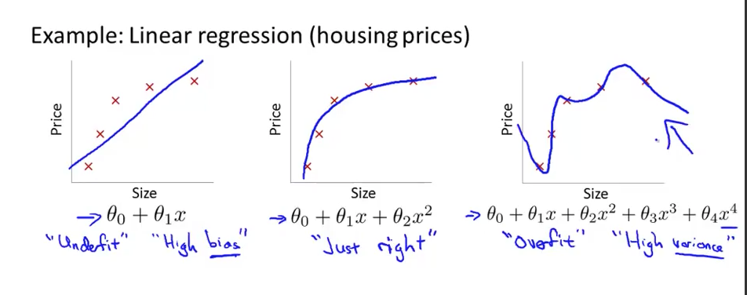
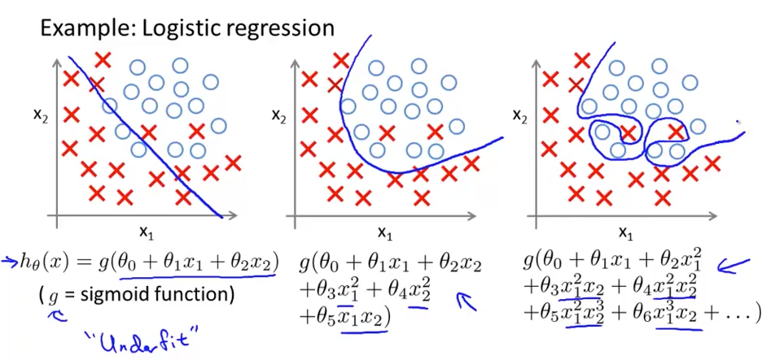

# 基础机器学习方法
@(MLNotes)

## 1. 过度拟合（Overfitting）
过度拟合的定义：大量的特征值导致假设函数对训练集拟合地特别完美（代价函数的值趋向于0），但是该模型无法泛化（generalize）到实际应用中碰到的新的数据集中。也就是说，这个模型只对当前的数据有效，相当于一种虚假的好结果。

*预测过度拟合举例*：

*分类过度拟合举例*：

解决办法：
1. 减少特征数量：
- 手动选择保留哪些特征
- 模型选择算法
2. 正则化 （Regularization）：
- 保留所有特征，但是降低参数 $\theta_j$ 的大小。
- 在特征非常多，并且每个特征对模型的贡献都很小的情况下特别管用。

### 1.1 正则化
正则化的目标是降低参数大小，我们可以通过在代价函数中添加正则项来达到目标：
$$\displaystyle J(\theta) = \frac{1}{2m}\left[\sum_{i=1}^m(h_\theta(x^{(i)}) - y^{(i)})^2 + \lambda\sum_{j=1}^n\theta_j^2\right]$$
正则参数 $\lambda$ 不能定义地过于太大，例如 $10^{10}$ ， 这样会导致除了 $\theta_0$ 之外的所有的参数无限接近于0。
