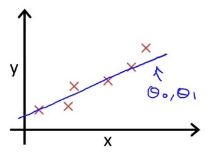
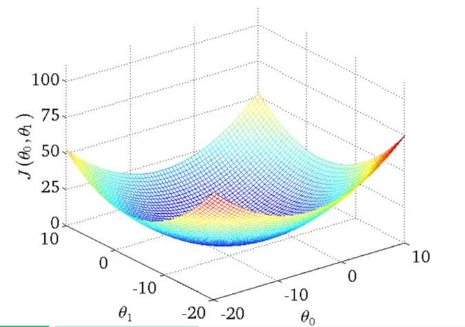

# 基础机器学习方法
@(MLNotes)

## 线性回归（Linear Regression）

假设我们有 m 份房屋面积以及对应的房屋价格信息，我们可以基于这些信息构建一个线性回归模型。假设 x 代表房屋面积数据（输入/特征），y 代表房屋价格（输出/目标）。

数据看起来就像下表这样：
面积(m^2)  | 房价($)
--|--
100  |  150,000
150  |  200,000
175  |  230,000
那我们的模型可以表示为：
$$h_{\theta}(x)=\theta_0+\theta_1x$$
这个函数其实就是一个对于 x 的一次方程，在平面上画出来就是一条简单的直线。如果用高中知识来解读，$\theta_1$就是斜率，$\theta_0$就是这条线的截距。为什么说这条线就是回归模型呢？首先我们假设有一个由 x, y 组成的坐标系，根据我们上面的表示，每一条房屋数据都可以看成一个由 x 数据（面积）和 y 数据（价格）组成的点。然后我们把所有这些点放入坐标系中，就会出现如下图所示的情况。

图中的点并不代表上表中的数据，表中的数据只是举例。所有已知的点用叉在图中进行了标识，我们的回归模型就是那条蓝色的线。因此我们的任务其实就是找到一条线，使它可以尽量完美地贴合现有的所有数据。如果一条完美的线确实存在，那对于任何新的房屋面积数据，我们就可以使用这个模型对房屋价格进行准确预测。这就是线性回归的目的。

接下来要做的就是让计算机找出这条线，完美的模型会使预测和真实情况之间的误差为0，但是因为完美的模型在现实中很少存在，所以我们要使我们的模型和真实情况之间的误差最小化。现在我们来定义模型和真实结果之间的误差：

$$\frac{1}{2m}\sum_{i=1}^{m} (h_{\theta}(x^{(i)})-y^{(i)})^2$$

对这个方程的解读其实很容易，前面的常量 $\frac{1}{2m}$ 先不考虑，后面的部分就是对于每一个 x，我们比较了它的预测值 $h_{\theta}(x^{(i)})$ 和它的真实值 y，取平方避免正负误差相抵消，并把所有的平方差加起来。m 是我们的数据总量，因此 $\frac{1}{2m}$ 这个常量的目的只是求了这个平方差的平均值，并除以2。由于这个方程中只有 $\theta_0$ 和 $\theta_1$ 是变量，因此我们可以说这是一个对于他们两个参数的方程 $J(\theta_0,\theta_1)$：

$$J(\theta_0,\theta_1)=\frac{1}{2m}\sum_{i=1}^{m} (h_{\theta}(x^{(i)})-y^{(i)})^2$$

$J(\theta_0,\theta_1)$ 这个就是我们的代价函数，也被称作平方误差代价函数，就是上面提到的误差的数学表达式，因此我们只需要找到两个值使得 $J(\theta_0,\theta_1)$ 这个函数的取值最小，这两个值就是确定我们线性回归模型的 $\theta_0$ 和 $\theta_1$ 。

写到这里其实对于线性回归是什么的内容已经说完，剩下的无非就是计算出的 $\theta_0$ 和 $\theta_1$ 的问题。可以说已经超出了线性回归的范围。但是有趣的是，即使是线性回归这种最简单的机器学习方法，想要找到这个最小值也并没有想象中的容易。我们来看一下代价函数的三维模型：

图中每个点对应的高度就是代价函数在这个点的取值，因此最低的代价值对应了这个碗型函数的碗底部。想要计算出这个最低点，我们要使用梯度递减算法。梯度递减算法不仅可以用在线性回归当中，事实上大量的机器学习算法会使用到梯度递减，准备另写一篇文章详细地讨论梯度递减算法。

$$\theta_j := \theta_j - \alpha\sum^m_{i=1}{(h_\theta(x^{(i)})-y^{(i)}){x_j}^{(i)}}$$
